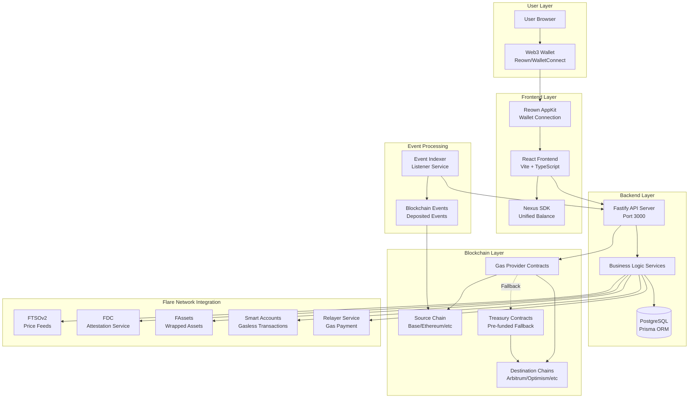
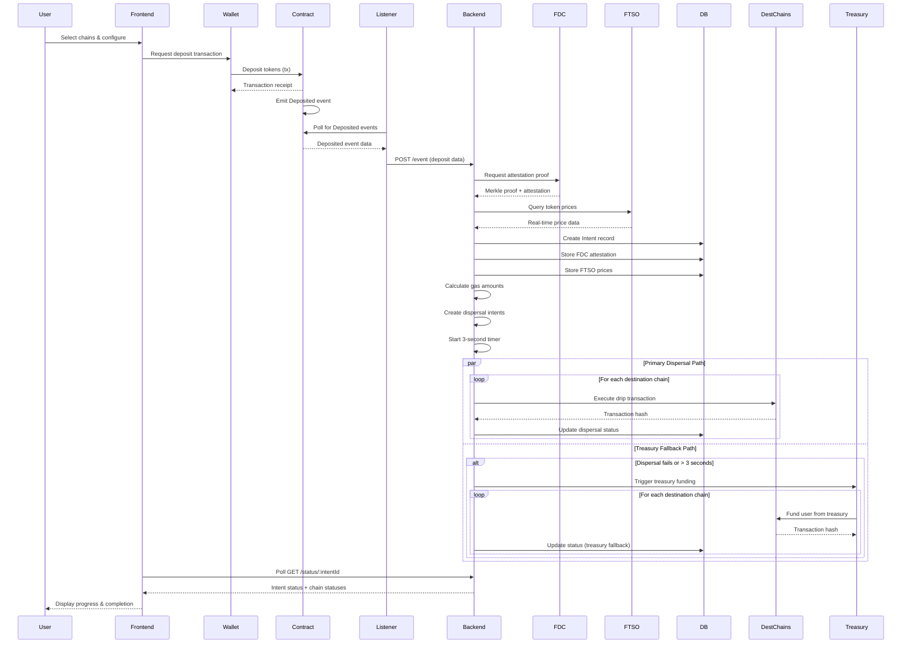
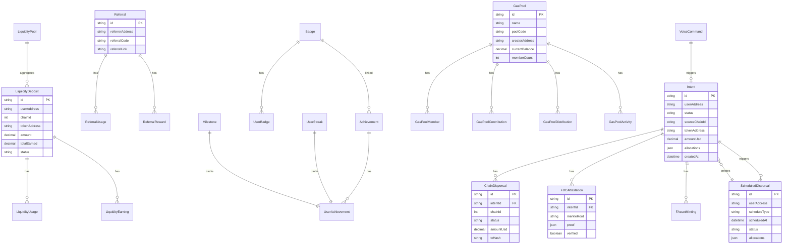
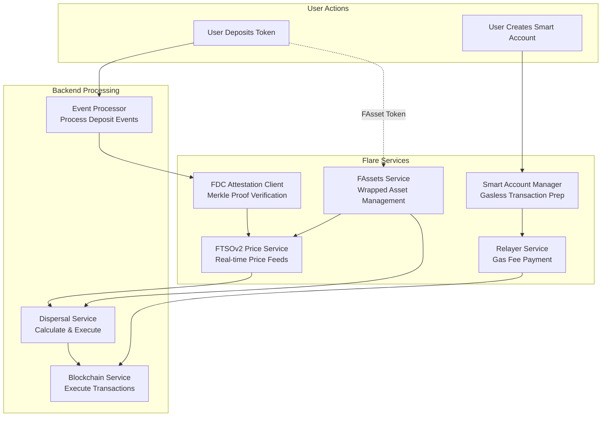
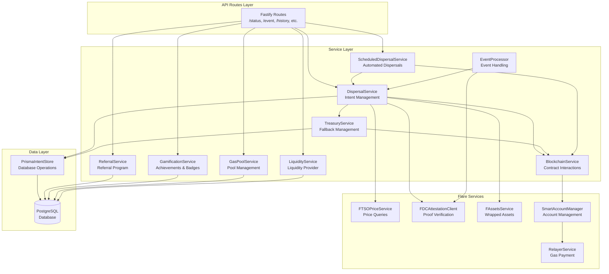
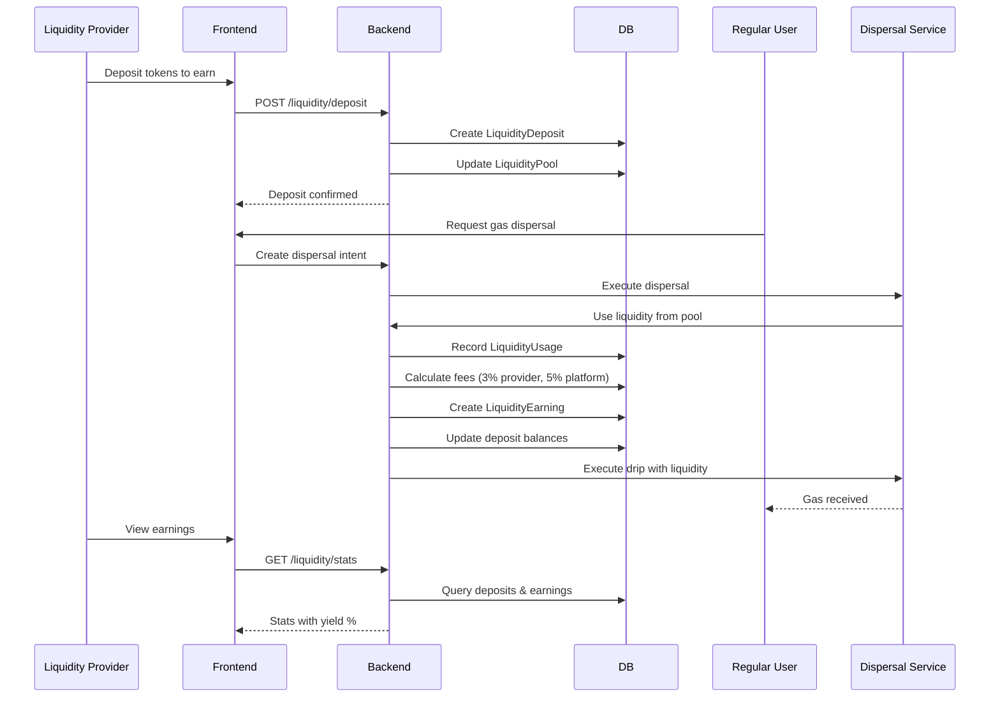
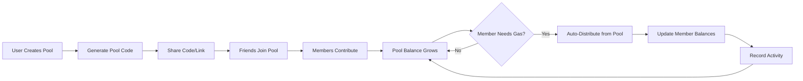
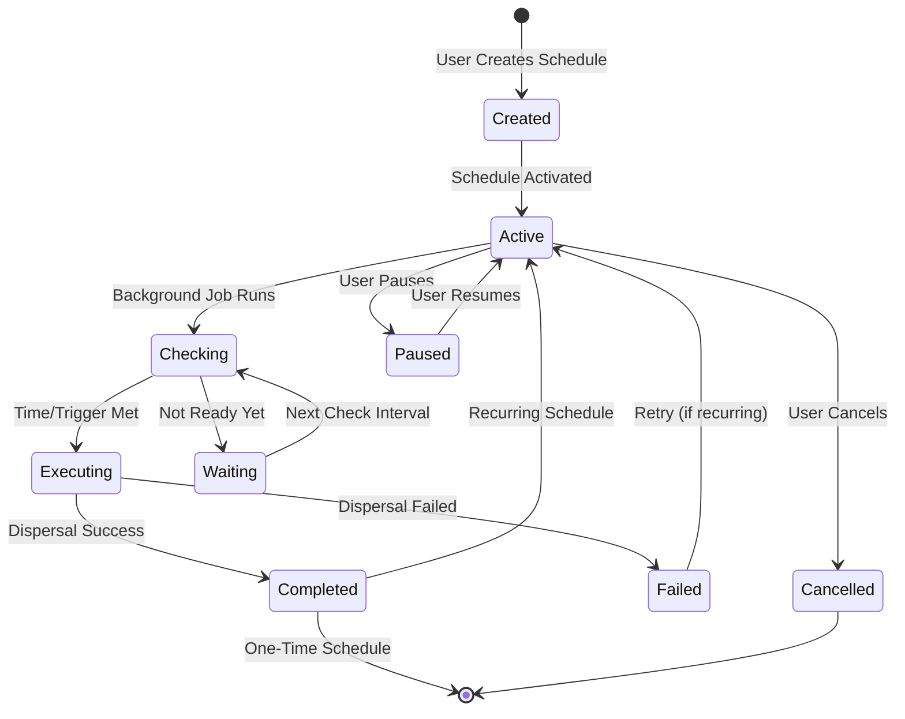
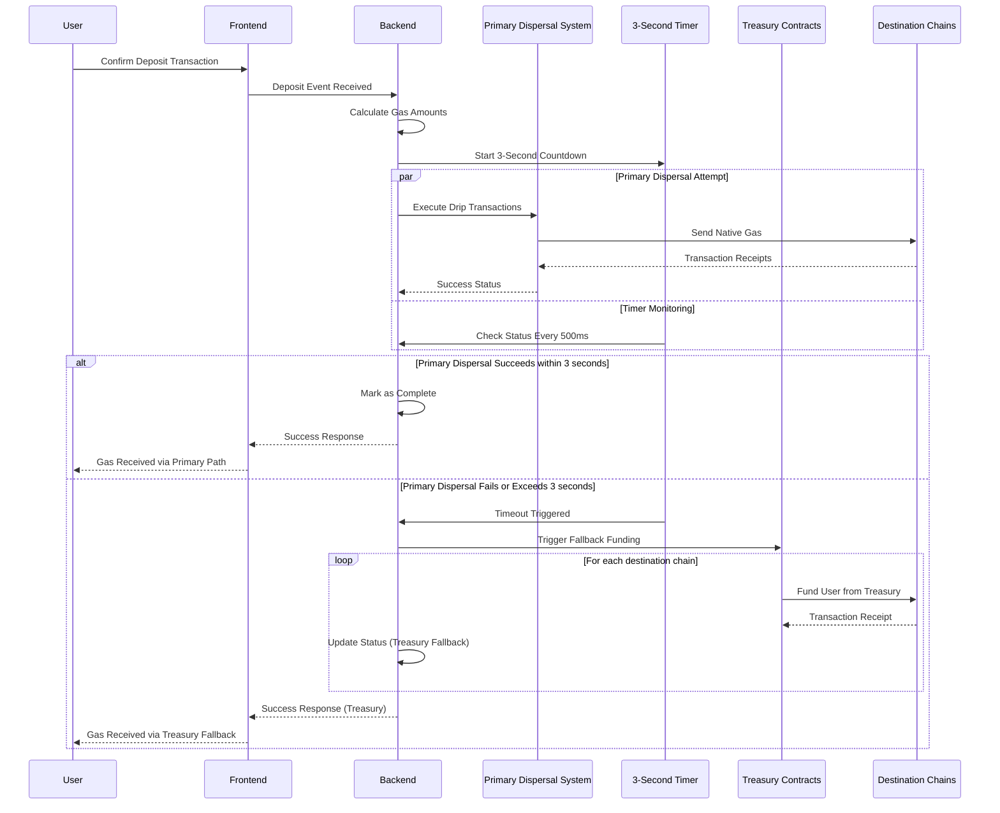

# ⛽ Gas Provider

**The first on-chain unified multilayer bridge solving the problems of millions.**

*Powered by FAssets + FDC + FTSOv2 + Flare Smart Accounts*

**Simply means "Get Any Token on Any Chain in 3 Seconds".**

---

## The Problem

Did you ever wonder how many tokens are there in the world?

- **Acc. to CoinMarketCap**: Around 27.9 Million Tokens
- **Acc. to Cryptopolitan**: There are 1000 Blockchains exist
- **Avg. user interacts with**: 25+ different chains
- **And if you are interacting with these chains**: You need their native tokens for paying GAS fees

Which simply means new chains require new native tokens which requires you bridging and sending these tokens.

**Result**: Loss of time, Loss of money, Fragmented Liquidity, High Friction and Dealing with Different tokens, different addresses, different processes.

### A Real Life Story

Amaan, a legendary dev won 41 hackathons. Every Sponsor sends him USDC, USDT, any other token on their familiar chain, which means Amaan receives the prize money but after receiving it every single time he has to bridge, swap and ask friends to send native tokens to his metamask wallet to transfer it to destination chain.

Which is hectic, time consuming, energy drainer and one wrong move to lose the assets.

**And this problem is not only with Amaan but also the problem of other 590 million crypto users in some or the other way.**

---

## The Solution - ⛽ Gas Provider

**Come with any token on any chain → Receive GAS on all chains in one single transaction within 3 seconds.**

Yea that's it. The most powerful project built to solve this problem.

Designed to Scale Globally, Actual real-life solution to the problem of each and every single crypto user.

### How It Works?

1. **User deposits USDC/USDT/FAssets on Chain A**
2. **Event indexed and verified**
3. **Prices fetched via decentralized oracles**
4. **Gas distributed across selected destination chains**
5. **Fallback treasury ensures success within 3s**

**Users receive:**
- Native ETH on Base
- OP on Optimism
- MATIC on Polygon
- etc...

**All in one single click**

## ⛽ Tech Stack

1. **User deposits USDC/USDT/FAssets on Chain A** → **FAssets** (if user deposits wrapped BTC/XRP/DOGE/LTC). Enables non-EVM assets to enter the ecosystem

2. **Event indexed and verified** → **FDC (Flare Data Connector)**. Verifies deposits cryptographically with Merkle proofs, prevents fraud or double spending

3. **Prices fetched via decentralized oracles** → **FTSOv2 (Flare Time Series Oracle)**. Real-time price feeds → accurate gas conversion, sub-block latency

4. **Gas distributed across destination chains** → **Smart Accounts + Relayer** (if gasless deposit path is required). Enables gasless execution and backend sponsorship of gas fees

5. **Fallback treasury ensures success within 3s** → **Smart Accounts + Relayer + FTSOv2 validation**. Ensures user always receives native gas — reliability guarantee

---

## Competitive Landscape

**We deliver what others can't:**

**Anything + Anywhere + Fast + Real + Simple**

---

## Market Opportunity

### Total Addressable Market (TAM):
- $2.5B+ in gas tokens across chains
- 500B+ in cross-chain volume annually

### Serviceable Addressable Market (SAM):
- 10M+ multi-chain users
- $50M+ monthly gas distribution needs
- 500K+ potential active users

### Serviceable Obtainable Market (SOM):
- 100K users in Year 1
- $5M monthly volume
- $1M+ annual revenue potential

---

## ⚡ Future

**Endless possibilities anything to everything related to bridge, swap, token transfer**

Gas Provider will be the **universal cross-chain gas layer** for the entire Web3 ecosystem.

**Every wallet → Every chain → One transaction**

**Gas everywhere**

---

## Features

- **Multi-Chain Gas Distribution**: Deposit once, receive gas on multiple destination chains
- **Gas Treasury Fallback System**: Automatic fallback to pre-funded treasury contracts if primary dispersal fails within 3 seconds, ensuring users always receive gas tokens
- **Flare Network Integration**: Leverages Flare's decentralized data infrastructure
  - **FTSOv2**: Real-time price feeds with block-latency updates (~1.8 seconds)
  - **FDC**: Cryptographic verification of cross-chain deposits
  - **FAssets**: Support for wrapped BTC, DOGE, XRP, and LTC
  - **Smart Accounts**: Gasless transactions for users without native tokens
- **Flexible Token Support**: USDC, USDT, and FAssets on supported chains
- **Transparent Tracking**: Real-time status updates for all dispersal operations

## How It's Made

The smart contracts are written in Solidity, the frontend uses Vite and React, and the backend is built with Fastify and Prisma. Smart contract testing and deployments use Hardhat.

### Architecture

1. **Smart Contracts**: Deployed on each supported chain to handle deposits and dispersals
2. **Treasury Contracts**: Pre-funded contracts on each destination chain that serve as fallback for instant gas distribution
3. **Event Indexer**: Monitors deposit events across all chains
4. **Backend API**: Processes events, manages intents, and coordinates dispersals
5. **Flare Integration**:
   - **FTSO Price Service**: Queries real-time prices for accurate token valuations
   - **FDC Attestation Client**: Verifies deposits with cryptographic proofs
   - **FAssets Service**: Handles wrapped asset deposits and redemptions
   - **Smart Account Manager**: Enables gasless transactions
   - **Relayer Service**: Pays gas fees for Smart Account transactions
6. **Frontend**: User interface for deposits, status tracking, and Smart Account management

### Flow

1. User deposits tokens into the escrow contract on a source chain
2. Indexer detects the deposit event and submits it to the backend
3. Backend requests FDC attestation to verify the deposit
4. FTSO provides real-time prices for token valuation
5. Backend calculates gas amounts and creates dispersal intents
6. **Primary Path**: Distributor executes drip transactions on destination chains
7. **Fallback Path**: If primary dispersal fails or takes longer than 3 seconds, Treasury contracts are automatically triggered to fund users on all destination chains
8. User receives native gas on all selected chains (either via primary dispersal or treasury fallback)

### Flare Network Integration

**Note**: All Flare features require proper environment variable configuration to be enabled.

#### FTSOv2 (Flare Time Series Oracle) 
- **Status**: ✅ Implemented, conditionally initialized
- Provides decentralized price feeds with sub-block latency
- Used for accurate token-to-gas conversions
- Supports fallback to alternative price sources
- Queries: FLR/USD, BTC/USD, XRP/USD, DOGE/USD, ETH/USD, USDC/USD
- **Requires**: `FLARE_RPC_URL` and `FTSO_V2_ADDRESS_*` environment variables

#### FDC (Flare Data Connector) 
- **Status**: ✅ Implemented, conditionally initialized
- Verifies deposit transactions with Merkle proofs
- Supports both EVM and non-EVM chains
- Provides cryptographic guarantees before dispersal
- Prevents double-spending and invalid deposits
- **Requires**: `FDC_HUB_ADDRESS`, `FDC_VERIFICATION_ADDRESS`, `STATE_CONNECTOR_ADDRESS` environment variables

#### FAssets 
- **Status**: ✅ Implemented, conditionally initialized
- Enables deposits of wrapped Bitcoin, Dogecoin, XRP, and Litecoin
- Queries underlying asset prices via FTSO
- Supports minting and redemption flows
- Expands platform to non-smart contract chains
- **Requires**: `ENABLE_FASSETS=true` and FAsset contract addresses in environment variables

#### Smart Accounts 
- **Status**: ✅ Implemented, conditionally initialized
- Allows gasless transactions for users without FLR
- Bundles approval and deposit into single transaction
- Relayer pays gas fees on behalf of users
- Automatic routing based on user balance
- **Requires**: `ENABLE_SMART_ACCOUNTS=true`, `SMART_ACCOUNT_FACTORY_ADDRESS_*`, and `RELAYER_PRIVATE_KEY` environment variables

## Setup

### Prerequisites

- Node.js 18+
- Docker and Docker Compose
- PostgreSQL (or use Docker Compose)

### Quick Start

1. **Clone the repository**
   ```bash
   git clone <repository-url>
   cd gas-provider
   ```

2. **Configure environment variables**
   ```bash
   # Backend configuration
   cd backend
   cp .env.example .env
   cp .env.flare .env.flare.local
   
   # Edit .env and .env.flare.local with your configuration
   # See backend/README.md for detailed variable documentation
   ```

3. **Start the backend with Docker Compose**
   ```bash
   cd backend
   docker-compose up -d
   ```

4. **Start the frontend**
   ```bash
   cd frontend
   npm install
   npm run dev
   ```

5. **Deploy contracts** (optional, for development)
   ```bash
   cd contracts
   npm install
   npx hardhat run scripts/deploy-usdc-gas-drip.ts --network <network>
   ```

### Flare Network Setup

To use Flare-specific features:

1. **Get testnet tokens**
   - Visit [Flare Faucet](https://faucet.flare.network/) for Coston2 testnet tokens
   - Fund your distributor and relayer wallets

2. **Configure Flare contracts**
   - Update `.env.flare.local` with Coston2 contract addresses
   - See `.env.flare` for complete configuration template

3. **Generate relayer key**
   ```bash
   node -e "console.log('0x' + require('crypto').randomBytes(32).toString('hex'))"
   ```
   Add the generated key to `RELAYER_PRIVATE_KEY` in `.env.flare.local`

4. **Test on Coston2**
   - Set `USE_TESTNET=true` in `.env.flare.local`
   - Deploy contracts to Coston2
   - Test deposits with testnet tokens

## Documentation

- [Backend README](backend/README.md): API documentation and environment variables
- [Frontend README](frontend/README.md): Frontend setup and development
- [Contracts README](contracts/README.md): Smart contract documentation
- [Flare Integration Spec](docs/FLARE_INTEGRATION_FILES.md/): Detailed integration design

## Project Structure

```
gas-provider/
├── backend/           # Fastify API server
│   ├── src/
│   │   ├── config/    # Chain and contract configuration
│   │   ├── services/  # Business logic (FTSO, FDC, FAssets, Smart Accounts)
│   │   ├── routes/    # API endpoints
│   │   └── store/     # Database layer (Prisma)
│   ├── prisma/        # Database schema
│   └── .env.flare     # Flare configuration template
├── frontend/          # React + Vite frontend
│   └── src/
│       ├── components/ # UI components
│       └── hooks/      # React hooks
├── contracts/         # Solidity smart contracts
│   ├── src/           # Contract source files
│   │   ├── GasProvider.sol  # Main deposit & dispersal contract
│   │   └── Treasury.sol    # Treasury fallback contract
│   └── test/          # Contract tests
└── listener/          # Event indexer service
```

## System Architecture Diagrams

### High-Level Architecture



### Data Flow Diagram



### Database Schema Diagram



### Flare Integration Flow



### User Journey Flow

```mermaid
flowchart TD
    Start([User Visits App]) --> Connect{Connect Wallet?}
    Connect -->|Yes| SelectChains[Select Destination Chains]
    Connect -->|No| Connect
    
    SelectChains --> SelectSource[Select Source Chain & Token]
    SelectSource --> Configure[Configure Transaction Counts]
    Configure --> Review[Review & Confirm]
    
    Review --> Deposit{Approve & Deposit?}
    Deposit -->|Yes| Execute[Execute Deposit Transaction]
    Deposit -->|No| Review
    
    Execute --> Wait[Wait for Confirmation]
    Wait --> Indexer[Event Indexer Detects]
    Indexer --> Backend[Backend Processes]
    Backend --> Verify[FDC Verification]
    Verify --> Price[FTSO Price Query]
    Price --> Calculate[Calculate Gas Amounts]
    Calculate --> Timer[Start 3-Second Timer]
    Timer --> Disperse[Attempt Primary Dispersal]
    
    Disperse --> Check{Success within<br/>3 seconds?}
    Check -->|Yes| Track[Track Progress]
    Check -->|No| Treasury[Treasury Fallback Triggered]
    
    Treasury --> TreasuryDisperse[Fund from Treasury Contracts]
    TreasuryDisperse --> Track
    
    Track --> Complete{All Complete?}
    Complete -->|No| Track
    Complete -->|Yes| Success([Gas Received on All Chains])
    
    style Start fill:#e1f5ff
    style Success fill:#d4edda
    style Deposit fill:#fff3cd
    style Disperse fill:#cfe2ff
    style Treasury fill:#ffe6e6
    style TreasuryDisperse fill:#ffe6e6
```



### Service Layer Architecture



### Liquidity Provider Flow



### Gas Pool Flow



### Scheduled Dispersal Flow



### Gas Treasury Fallback Flow



## Supported Chains

### Source Chains (Deposit)
- Ethereum Mainnet
- Optimism
- Arbitrum
- Base
- Polygon
- BNB Chain
- Avalanche
- Scroll
- Zora
- World Chain
- **Flare Mainnet** (with FAssets support)
- **Coston2 Testnet** (for development)

### Destination Chains (Gas Distribution)
All source chains plus any EVM-compatible chain where contracts are deployed.

## Security

- Private keys are managed through environment variables
- FDC attestations provide cryptographic proof of deposits
- Smart Account transactions are validated before execution
- Relayer balance monitoring prevents service interruption

**Never commit private keys to version control.**

## Contributing

Contributions are welcome! Please follow these guidelines:

1. Fork the repository
2. Create a feature branch
3. Make your changes with tests
4. Submit a pull request

## Links

- **Pitch Deck:** https://docs.google.com/presentation/d/1dcDHlryNzrDfVudiqPB-xnrNiIX9w971PFaoAP4Jztk/edit?usp=sharing
- **Pitch + Demo Video:** https://drive.google.com/file/d/1ysR1alZ418DzUM7PM9SSMkiwXTO0UyIM/view?usp=sharing
